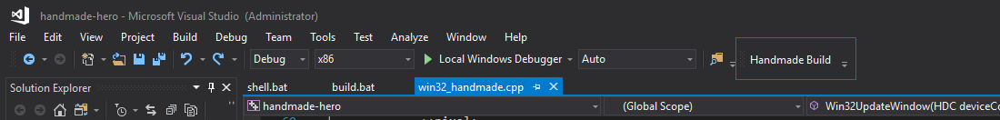

# handmade-hero

## Usage
- in build.bat configure the path of vcvarsall.bat in your pc

Use the VS solution file in projects folder. To build you can either:
- manually run the **code/build.bat**
- use the build button in visual studio by importing the **projects/handmade-build-tool.vssettings** to by go to **Tools -> Import and Export Settings -> Import**. This should appear

